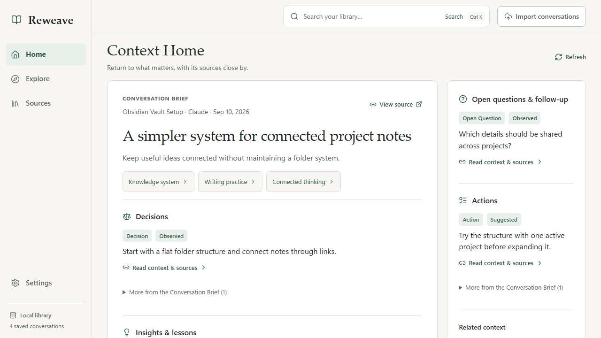
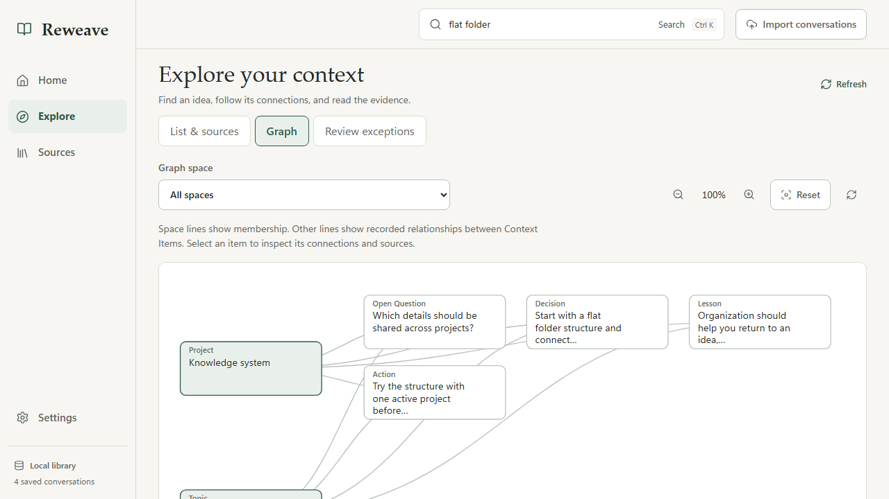

# Reweave

**Bring the useful parts of your AI conversations into the next one.**

**English** · [한국어](README.ko.md)

[Quick start](#quick-start) · [How to use it](#your-first-save-and-use) · [Privacy](#privacy-and-your-data) · [Development](docs/DEVELOPMENT.md) · [Roadmap](docs/ROADMAP.md)

[](LICENSE)
[](#quick-start)
[](#project-status)

Reweave is a local Windows app that turns the ChatGPT and Claude conversations you
choose into a searchable, connected library. Find a decision you made last month,
check the conversation behind it, and bring relevant context into a new chat
without writing the same background again.

You keep using ChatGPT or Claude. Reweave keeps the context between conversations.



*The Reading Room interface, captured from the running app with synthetic example
data. The application UI is currently in English.*

## Why Reweave?

Useful work often gets buried in chat history: a tradeoff you settled, a lesson
you learned, or the reasons behind a project plan. Reweave makes those pieces
available for the next conversation.

| When you want to… | Reweave helps you… |
| --- | --- |
| Pick up a project after a break | Revisit its decisions, open questions, and next actions. |
| Move from one AI assistant to another | Add relevant context to your next ChatGPT or Claude draft. |
| Understand where a claim came from | Open its supporting message, inspect the evidence, and correct it. |
| Find an idea without remembering the exact chat | Search the library and follow connections between topics and projects. |

## What you can do

- **Save the conversations you choose.** Import ChatGPT/Claude exports or save the
  current conversation through the Chrome/Edge extension. Saving works without an API key.
- **Read the useful context.** Analysis creates a **Conversation Brief** for the
  whole chat and **Context Items** for supported decisions, lessons, preferences,
  facts, questions, and actions. Items distinguish observations, inferences, and suggestions.
- **Follow the evidence.** Browse Home, Explore, and Sources; follow linked spaces
  and open the original messages behind an item.
- **Search locally.** Keyword search works immediately. Optional Smart search
  adds meaning-based retrieval using a model that runs on your device.
- **Reuse context deliberately.** **Use Reweave context** adds relevant, allowed
  context before your existing draft. You review it and decide when to send.
- **Correct and maintain your library.** Edit context with version history and
  undo, rename or merge spaces, and resolve exceptions in Review.
- **Back up and explore connections.** Create password-encrypted backups, restore
  a library, explore its graph, or preview a redacted graph image for export.

<details>
<summary>See the graph view</summary>



The graph uses the same items and relationships as Home and Explore. Select a node
to inspect its context and sources. This capture also uses synthetic example data.

</details>

## Quick start

**Current availability:** Reweave is in development. As of September 11, 2026, this
repository has no published GitHub release. Start from source below. Windows
packaging is available for local builds; the installer is currently unsigned.

### Run from source on Windows

You need **Git**, **Python 3.11+**, [**uv**](https://docs.astral.sh/uv/getting-started/installation/),
and **Node.js 22.12+ with npm**. The desktop window uses Microsoft Edge WebView2.

Run these commands in PowerShell:

```powershell
git clone https://github.com/seolbbb/reweave.git
cd reweave
uv sync --locked
cd frontend
npm ci
npm run build
cd ..
uv run reweave desktop
```

This opens the desktop app. Onboarding lets you import past conversations or skip
straight to an empty library. **You can import, browse, and search before connecting
an AI provider.**

To explore without personal data, import the included
[`tests/fixtures/chatgpt_sample.json`](tests/fixtures/chatgpt_sample.json) through
**Import conversations**. Its original messages are searchable immediately;
generated Briefs and Context Items require analysis.

Prefer the local browser interface? After building the frontend, run:

```powershell
uv run reweave app --db ./reweave.db
```

Open [http://127.0.0.1:8765](http://127.0.0.1:8765), and stop the server with `Ctrl+C`
when finished. This command uses a database in the current folder; the desktop
uses a different default location. The browser extension requires the desktop
launcher. See [data locations](#where-is-my-library-stored) before switching launch modes.

### Build the Windows package

After the source setup and frontend build, run from the repository root:

```powershell
.venv\Scripts\pyinstaller.exe --noconfirm --clean packaging\Reweave.spec
.\dist\Reweave\Reweave.exe
```

Keep the entire `dist\Reweave` folder together; the executable depends on its
bundled files. Python and Node.js are not required on the computer running this bundle.

To create the per-user installer, follow the
[Windows packaging guide](packaging/installer/README.md#repeating-the-build).
It produces `dist\Reweave-Setup.exe` and a manifest with file hashes. The installer
includes the extension but leaves its browser installation and registration to you.

## Your first Save and Use

```text
Choose a conversation → Save or Import → Analyze → Read and check → Use in a new draft
                        stored locally    BYOK      local library    you press Send
```

### 1. Add a conversation

Choose **Import conversations** and select a supported `.json` or `.zip` export.
Start with a few conversations you want to revisit, or import a whole export to
build up your history. Repeated imports and Saves update existing conversations
without duplicating unchanged content.

Supported imports are ChatGPT `conversations.json`, Claude conversation JSON, and
ZIP files containing those formats. ZIP import reads supported JSON files;
attachments and other non-JSON files are not imported. Arbitrary PDFs, notes,
webpages, and other chat providers are outside the current import scope.

For everyday browser capture, set up the extension below and choose
**Save current conversation**. Wait until the assistant has finished responding.

### 2. Connect analysis when you are ready

In **Settings**, choose a provider, connect your API key, and select an available
model. Supported settings include OpenAI, Anthropic, Google Gemini, OpenRouter,
and OpenAI-compatible endpoints. A compatible endpoint also needs its base URL.
Your analysis provider can differ from the assistant that produced the conversation.

**BYOK** means *bring your own API key*. Reweave sends selected conversation content
directly to that provider for analysis, and the provider's API charges may apply.
Connecting an active provider can start pending analysis automatically, so review
your queued sources and the [privacy boundaries](#privacy-and-your-data) first.

Context activity shows progress, pause/retry controls, and daily request/token
allowances. These are usage safeguards, not an exact currency spending cap. Long
conversations are processed in resumable parts; incomplete work is shown as incomplete.

### 3. Read, check, and correct

Open **Home** for a readable overview or **Explore** to follow projects and topics.
Use **Read context & sources** or **View source** to check the supporting conversation.
Correct an inaccurate item or scope; the library keeps history and offers undo.
Some conversations produce a useful Brief without any individual Context Items.

### 4. Bring context into your next chat

With Reweave running, write a request in a supported ChatGPT or Claude conversation,
then open the extension and choose **Use Reweave context**.

On first use, choose the destination and retry **Use**. Private allows relevant
ordinary context across spaces; Work, Client, and Shared require allowed scopes.
Sensitive context needs a separate preview and confirmation. Reweave remembers
your destination choice for that conversation.

Review the block added before your draft, then send when you are ready. Your draft
is preserved, and a later explicit Use replaces the previous block. **Use does not
save the current conversation or press Send.**

### Set up the Chrome or Edge extension

1. [Build the Windows package](#build-the-windows-package) so `ReweaveNativeHost.exe` exists.
2. Open `chrome://extensions` or `edge://extensions`, enable **Developer mode**,
   choose **Load unpacked**, and select this repository's `extension` folder.
3. Copy the extension ID shown by that browser.
4. From the repository root, run the following command, replacing the ID and
   using `-Browser Edge` if you use Edge:

```powershell
.\scripts\register_native_host.ps1 -ExtensionId 'YOUR_32_CHARACTER_EXTENSION_ID' -Browser Chrome
```

5. Start `.\dist\Reweave\Reweave.exe`, open a ChatGPT or Claude conversation, and
   open the extension. `Alt+Shift+R` opens the same popup on Windows unless remapped.

The registration script connects that extension to the local app using the current
Windows user's Native Messaging settings. No local URL or token needs to be copied.
For an installer-based setup, use the different paths in the
[installed-extension guide](packaging/installer/README.md#browser-extension-an-explicit-second-step).
See the [extension guide](extension/README.md) for permissions and behavior.

## Privacy and your data

| Action | What happens to your data |
| --- | --- |
| Save / Import | The selected conversation is stored locally before analysis. There is no passive conversation capture. |
| Browse / Search | Retrieval runs locally. Enabling Smart search downloads a model, then builds embeddings locally. |
| AI analysis | Selected sources go directly to your chosen BYOK provider. Relationship analysis may also send a bounded set of compatible existing summaries. |
| Use | The current chat and draft are processed locally for retrieval without being saved. Inserted context becomes available to the destination webpage, even before you press Send. |
| Backup | A password-encrypted `.reweave` file contains the library and settings, but not API keys. Restored providers need reconnection. |
| Share / Diagnostics | Export is explicit. Graph sharing uses a redacted preview; diagnostics omit conversation text and credentials. Posting a file elsewhere is your choice. |

API keys saved in Settings use the operating-system credential store. **The live
SQLite library is not encrypted at rest; encrypted backups do not encrypt the live
database.** Removing an original conversation leaves derived context and retained
evidence; delete those separately when you intend to remove them too.

Local storage does not make remote analysis private to your device. Sensitive-use
confirmation controls context reuse; it does not redact a source you select for
analysis. Read the [privacy and support guide](docs/release/PRIVACY_AND_SUPPORT.md)
for the full data lifecycle.

## FAQ and troubleshooting

### Do I need an API key or a Reweave account?

No Reweave account is required. Save, import, browsing, and keyword search work
without a key. Creating Briefs and Context Items requires a configured analysis
provider. Optional local Smart search requires a model download, but no API key.

### Where is my library stored?

The desktop defaults to `%LOCALAPPDATA%\Reweave`; CLI commands and `reweave app`
default to `./reweave.db`. Use `--db` or `REWEAVE_DB` to select a database, and
`REWEAVE_DATA_DIR` to relocate the desktop's data/settings/model directory.
Only one app or CLI process can use a library at a time. See
[configuration](docs/DEVELOPMENT.md#configuration) for examples.

### Why is analysis pending, or why is Home empty?

Check the active provider, pause state, daily allowance, and retry time in Context
activity. Until analysis finishes, your saved conversations are still available
in **Sources** and search. You can retry a failed source or choose **Analyze** in Sources.

### Why does the extension say to open Reweave?

Start the desktop app, then check the registered Native Host path, browser, and
extension ID. Loading the unpacked extension alone is not enough. Retry from a
supported, fully loaded conversation after its response finishes.

### Can I sync devices or use other platforms?

The current desktop target is Windows; the extension targets Chrome and Edge with
ChatGPT and Claude. Account-backed sync, macOS, additional chat providers, and team
libraries are outside the current release path. You can move a library with an
encrypted backup. The application UI is English; this README is also available in Korean.

## Project status

The Reading Room, Save/Use, linked context, corrections, search, graph, and encrypted
maintenance flows have implementation and isolated verification evidence. Real-owner
daily-use acceptance, normal Windows file-dialog checks, and public distribution
remain open. Screenshots and automated checks do not establish personal usefulness.

See [Project Status](docs/PROJECT_STATUS.md) for current evidence,
[Roadmap](docs/ROADMAP.md) for remaining work, and
[Product Spec](docs/PRODUCT_SPEC.md) for the intended behavior.

## Contributing and support

Bug reports, documentation improvements, and focused fixes are welcome.
[Open an issue](https://github.com/seolbbb/reweave/issues) with reproducible steps,
expected behavior, and what happened. Use synthetic examples and review screenshots
before sharing; never attach private exports, databases, backups, or API keys.

For code or documentation changes, read [AGENTS.md](AGENTS.md) and the
[development guide](docs/DEVELOPMENT.md). **All pull requests target `dev`**, and
merges use merge commits. Commits, PRs, code comments, and canonical documentation
are in English; the Korean README is an explicitly approved exception.

## License

[MIT](LICENSE).
